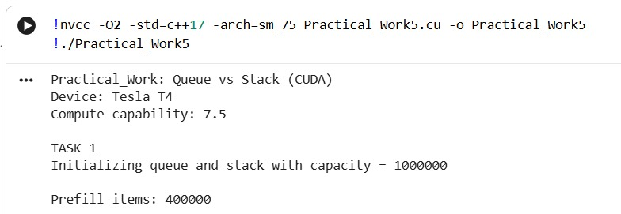
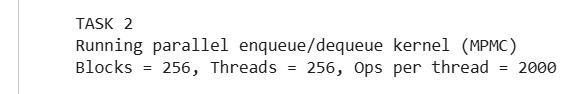
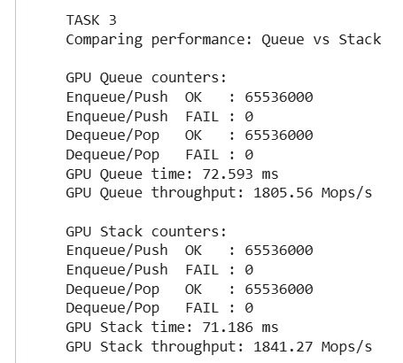
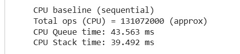

# Practical_Work5

## Таск 1. 

В первом задании была реализована инициализация параллельной очереди на GPU с заданной ёмкостью (capacity). Очередь хранится в глобальной памяти в виде кольцевого буфера: данные лежат в массиве `data`, а доступ к ним организован через индексы `head` и `tail`. Для того чтобы структура корректно работала при параллельном доступе, дополнительно используются счётчики `items` (сколько элементов реально лежит в очереди) и `slots` (сколько свободных мест осталось). При старте работы индексы и счётчики обнуляются, а `slots` устанавливается равным ёмкости, чтобы очередь считалась пустой, но готовой принимать элементы.

После инициализации структура дополнительно предварительно заполняется (prefill), чтобы в следующих тестах операции `dequeue` не были постоянно неуспешными из-за пустой очереди. Это позволяет более честно измерять производительность, так как потоки действительно выполняют полезные операции, а не только фиксируют «пусто».

Результаты выполнения программы представлены на скриншоте:

  

  

---

## Таск 2. 

Во втором задании было реализовано CUDA-ядро, в котором операции добавления (enqueue) и удаления (dequeue) выполняются параллельно большим количеством потоков. Логика теста построена так, чтобы одновременно имитировать работу производителей и потребителей: потоки с чётным `tid` пытаются выполнять `enqueue`, а потоки с нечётным `tid` — `dequeue`. Таким образом получается типичная конкурентная ситуация, когда разные потоки одновременно меняют общую структуру данных.

Для того чтобы избежать конфликтов, используются атомарные операции. При `enqueue` поток сначала пытается «занять слот» (уменьшить `slots`), затем резервирует позицию через `tail`, записывает значение в буфер и только после этого увеличивает `items`. Для корректности применяется `__threadfence()`, чтобы гарантировать, что запись в глобальную память стала видна другим потокам до того, как очередь объявит, что элемент уже существует. При `dequeue` логика обратная: поток сначала уменьшает `items`, затем резервирует позицию через `head`, считывает значение и освобождает слот (увеличивает `slots`). Это обеспечивает корректность даже при одновременной работе большого числа потоков.

Результаты выполнения программы представлены на скриншоте:

  

  

---

## Таск 3. 

В третьем задании было выполнено сравнение производительности двух параллельных структур данных: очереди (FIFO) и стека (LIFO). Для корректного сравнения обе структуры имеют одинаковую ёмкость, одинаковое количество потоков и одинаковое число операций на поток. Время измеряется с помощью CUDA events, чтобы получить именно время выполнения GPU-ядра.

Стек реализован похожим образом: используется массив данных в глобальной памяти, счётчики `items/slots` и атомарный индекс `top`, который играет роль вершины стека. В тестовом ядре потоки также делятся на «производителей» (push) и «потребителей» (pop), что позволяет сравнить поведение структур при одинаковой конкурентной нагрузке. По итогам программа выводит время выполнения и throughput (операции в секунду), а также счётчики успешных и неуспешных операций. Такое сравнение показывает, какая структура лучше справляется с параллельной нагрузкой именно в выбранной конфигурации.

Результаты выполнения программы (Queue vs Stack performance) представлены на скриншоте:

  

  

---

## Дополнительные задания

В рамках дополнительных заданий была реализована очередь с поддержкой нескольких производителей и потребителей (MPMC). Именно такой режим работы моделируется тестовым ядром: одновременно часть потоков делает enqueue, а часть потоков делает dequeue. Корректность обеспечивается атомарными операциями и счётчиками `items/slots`, которые работают как простые «семафоры» и не дают структуре выйти за пределы ёмкости или уйти в отрицательные значения элементов.

Также было выполнено сравнение с последовательными версиями на CPU. Для этого реализованы простые базовые реализации очереди и стека на CPU, которые выполняют чередование enqueue/dequeue и push/pop. Это позволяет увидеть разницу между параллельным вариантом на GPU и последовательным вариантом на CPU при схожем количестве операций. Пример результатов CPU baseline представлен на скриншоте ниже (эти значения затем можно использовать в отчёте для сравнения).

  

---

# Контрольные вопросы

## 1. В чём отличие стека и очереди?

Очередь работает по принципу FIFO (first in — first out): первым извлекается тот элемент, который был добавлен раньше. Стек работает по принципу LIFO (last in — first out): первым извлекается последний добавленный элемент. Из-за этого структуры по-разному распределяют нагрузку по памяти и по-разному ведут себя при конкурентном доступе.

## 2. Какие проблемы возникают при параллельном доступе к данным?

Основные проблемы — гонки данных (race conditions), когда несколько потоков одновременно читают и изменяют общие переменные. Например, два потока могут попытаться записать в одну и ту же позицию или одновременно изменить индекс `head/tail/top`. Без защиты это приводит к потере данных, повреждению структуры и некорректным результатам.

## 3. Как атомарные операции помогают избежать конфликтов в параллельных структурах данных?

Атомарные операции гарантируют, что изменение общей переменной происходит как единое неделимое действие. Это позволяет безопасно увеличивать/уменьшать индексы и счётчики (`head`, `tail`, `top`, `items`, `slots`) без ситуации, когда два потока «перетрут» изменения друг друга. В данной работе атомики используются для резервирования позиции в структуре и для корректного учёта элементов и свободных мест.

## 4. Какие типы памяти CUDA используются для хранения данных?

В реализации используются: глобальная память (основной буфер структуры), регистры/локальная память (временные переменные потоков) и служебные данные структуры (указатели и счётчики, которые также лежат в глобальной памяти). Разделяемая память может применяться как оптимизация, например для буферизации операций внутри блока, но базовая корректная версия работает через глобальную память и атомики.

## 5. Как синхронизация потоков влияет на производительность?

Синхронизация (например, через атомарные операции или барьеры) снижает параллелизм, потому что потоки вынуждены «ждать» друг друга или конкурировать за общий ресурс. Чем больше конфликтов и чем чаще используются атомарные операции, тем сильнее падает производительность. Поэтому важно минимизировать точки конкуренции и, где возможно, переносить часть работы в shared memory внутри блока.

## 6. Почему разделяемая память важна для оптимизации работы параллельных структур данных?

Shared memory значительно быстрее глобальной памяти и удобна для локального взаимодействия потоков внутри одного блока. Если часть операций можно агрегировать или буферизировать в shared memory (например, собирать несколько операций и затем выполнять их пакетно), то уменьшается число обращений к глобальной памяти и число конфликтующих атомарных операций. Это часто даёт прирост производительности, особенно при высокой конкурентной нагрузке.
